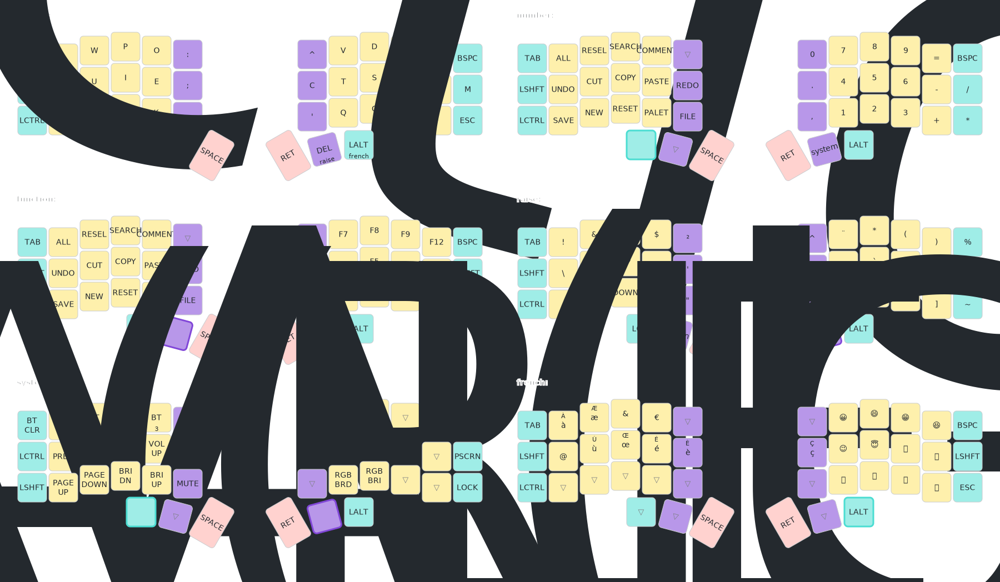

# Corne ZMK config

## Resources
- [Default corne config](https://github.com/zmkfirmware/zmk/blob/main/app/boards/shields/corne/corne.conf)
- [Corne Cherry v3 build guide](https://github.com/foostan/crkbd/blob/main/corne-cherry/doc/v3/buildguide_en.md)
- [CORNE BUILD GUIDE by devpew](https://devpew.com/blog/corne-eng/)

## My Corne choc
- ✅ [Corne choc board ( splitkb Aurora ) ](https://splitkb.com/collections/keyboard-kits/products/aurora-corne)
- ✅ [nice!nano V2 Wireless Controller](https://splitkb.com/products/nice-nano)
- ✅ [OLED Display SSD1306 128×32](https://splitkb.com/products/oled-display?variant=31716335648845)
- ✅ [SK6812 MINI-E RGB LEDs 3535 for backlight](https://splitkb.com/products/sk6812mini-e-rgb-leds?variant=46876570026331)
- ✅ [WS2812B RGB LEDs 5050 for underglow](https://splitkb.com/products/ws2812b-rgb-led?variant=43396705288451)

## Tool
- [ZMK](https://zmk.dev/)
- [Keymap drawer](https://pypi.org/project/keymap-drawer/)

## Photo

## current dispostion

